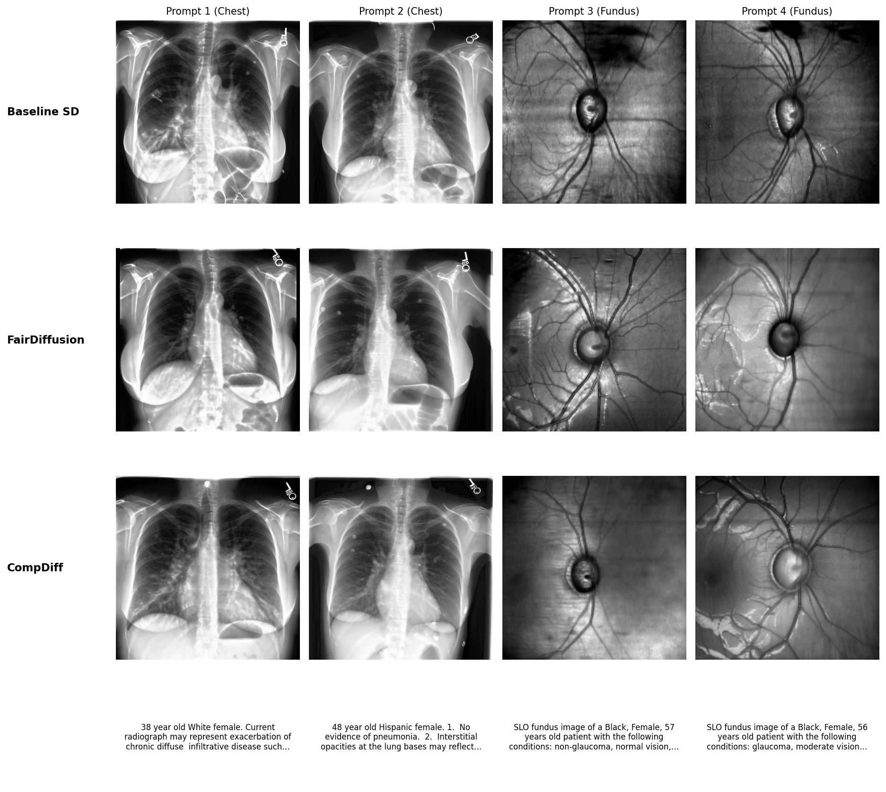

# CompDiff: Hierarchical Compositional Diffusion for Fair and Zero-Shot Intersectional Medical Image Generation

A framework for conditioning Stable Diffusion on demographic attributes (age, sex, race/ethnicity), with multiple methods and baselines for comparison.

## Key features

- **Hierarchical composition (HCN)** — Structured encoding of age, sex, and race with auxiliary supervision
- **Demographic Encoder** — Lightweight flat MLP alternative
- **FairDiffusion** — Fairness-aware training via adaptive re-weighting
- **Multiple baselines** — Standard fine-tuning and combined HCN + FairDiffusion

---

## Installation

```bash
git clone <repository-url>
cd skeleton_directory

conda create -n roentgen python=3.10
conda activate roentgen

pip install -r requirements.txt
```

Install PyTorch with CUDA from [pytorch.org](https://pytorch.org/) for GPU support.

---

## Quick Start

```bash
pip install -r requirements.txt

cd gen_source
python train.py --config_file ../configs/hcn/train_hcn_age_from_promt.yaml
```

---

## Download and Prepare Data

Before training on your own data, obtain the source datasets and build WebDataset tar files.

### Chest X-ray (MIMIC-CXR)

- **Source:** [MIMIC-CXR Database v2.1.0](https://physionet.org/content/mimic-cxr/2.1.0/) (PhysioNet)
- **Access:** Credentialed access: PhysioNet account, required training (e.g. CITI), and data use agreement.
- **Contents:** Chest radiographs and reports; see [PhysioNet documentation](https://physionet.org/content/mimic-cxr/2.1.0/) for layout.

**Prepare WebDataset:** Use a split CSV (columns: `split`, `image`, `final_sentence`, disease labels, demographics). Then:

```bash
python prepare_datasets/prepare_chest_dataset.py \
  --source_dir /path/to/your/mimic-cxr \
  --output_dir /path/to/your/chest_webdataset \
  --split_csv /path/to/your/split_data.csv
```

### Fundus (FairGenMed)

- **Source:** [FairGenMed dataset](https://drive.google.com/drive/folders/1kWgH6KGiIbtLMiXKUJpbcoXY8n28wSc2?usp=drive_link) (Google Drive), see [FairDiffusion](https://github.com/Harvard-Ophthalmology-AI-Lab/FairDiffusion).
- **Access:** Download from Drive; non-commercial research only (CC BY-NC-ND 4.0).
- **Contents:** SLO fundus images and NPZ files; base directory with `Training/`, `Validation/`, `Test/` and `data_summary.csv`.

**Prepare WebDataset:**

```bash
python prepare_datasets/prepare_fundus_dataset.py \
  --fundus_base_dir /path/to/your/fairgenmed \
  --output_dir /path/to/your/fundus_webdataset
```

Use `--help` on each script for options (`--max_samples_per_tar`, `--splits`, etc.).

### Demo data

- **WebDatasets:** Pre-built examples in `demo_chest/` and `demo_fundus/` to run the pipeline without full datasets.
- **Chest demo CSV:** `real_chest/split_data_demo.csv` — 10 rows, columns required by the chest script. Use with `--split_csv real_chest/split_data_demo.csv`.
- **Chest image layout:** `chest_images_skeleton/` mirrors the MIMIC-CXR directory structure with placeholder images for those 10 rows; use `--source_dir chest_images_skeleton` for a minimal run. See `chest_images_skeleton/README.md` for the layout.

### Pretrained models

The `pretrained_models/` directory holds weights used for validation and metrics:

- **Sex classifier:** `pretrained_models/sex/resnet-all/epoch=13-step=7125.ckpt` — used for demographic (sex) prediction on generated images during validation. Configs point to this path by default.
- **FID / RadImageNet:** `pretrained_models/fid_radnet/` — RadImageNet ResNet50 weights and radimagenet-models code. Used when `compute_fid_radimagenet: true` in the config: validation computes FID (and optional subgroup/intersectional FID) with RadImageNet embeddings. The code loads from this directory when present, else falls back to torch.hub. See `pretrained_models/README.md` for layout and usage.

**Our trained best checkpoints** for HCN (chest X-ray and fundus) will be made available online for reproduction and downstream use.

---

## Methods comparison

| Method | Description | Config | Use case |
|--------|-------------|--------|----------|
| **HCN** | Hierarchical composition (age×sex×race) + auxiliary loss | `configs/hcn/train_hcn_age_from_promt.yaml` | Best performance, structured encoding |
| **Demographic Encoder (V4)** | Flat MLP, no hierarchy | `configs/v4/train_demographic_encoder.yaml` | To ablate the hiererichal architecture |
| **v0 Baseline** | Standard SD fine-tuning | `configs/v0/train_baseline.yaml` | Baseline |
| **FairDiffusion** | Adaptive re-weighting (Bayesian) | `configs/fairdiffusion/train_baseline_fairdiffusion.yaml` | Fairness-aware |
| **HCN + FairDiffusion** | Both enabled | Set both flags in config | Ablation |

---

## Architecture overview

- **HCN:** Grandparents (age, sex, race) → Parents (pairwise) → Child (full composition); output token + auxiliary classifiers.
- **Demographic Encoder:** Embeddings + MLP; single token or separate tokens for age, sex, race.
- **Baselines:** v0 = demographics in text only; FairDiffusion = per-sample re-weighting.


---

## Usage

### Training

```bash
cd gen_source

# HCN
python train.py --config_file ../configs/hcn/train_hcn_age_from_promt.yaml

# Demographic Encoder (V4)
python train.py --config_file ../configs/v4/train_demographic_encoder.yaml

# Baseline
python train.py --config_file ../configs/v0/train_baseline.yaml

# FairDiffusion
python train.py --config_file ../configs/fairdiffusion/train_baseline_fairdiffusion.yaml
```

### Multi-GPU (Accelerate)

```bash
accelerate launch --num_processes=6 --multi_gpu --mixed_precision bf16 \
  gen_source/train.py --config_file configs/baseline_SD/train_baseline.yaml
```

### Validation monitoring

```bash
accelerate launch --num_processes=8 --multi_gpu --mixed_precision bf16 \
  gen_source/run_validation_monitor_debug.py \
  --config_file configs/hcn/train_hcn_age_from_promt.yaml \
  --check_interval 300
```

### Synthetic dataset generation

```bash
accelerate launch --num_processes=6 --multi_gpu --mixed_precision bf16 \
  gen_source/generate_synthetic_dataset.py \
  --config_file configs/hcn/train_hcn_age_from_promt.yaml \
  --checkpoint_path outputs/checkpoint-20000 \
  --output_dir synthetic_datasets/output \
  --merge_csv
```

### Downstream chest evaluation

Train and evaluate downstream classifiers (e.g. pathology) on real vs. synthetic chest data. Run from the repo root:

```bash
python downstream_eval_chest/train_downstream_classifier.py --help
python downstream_eval_chest/train_downstream_classifier.py \
  --strategy 1a \
  --real_train_path demo_chest/training_data \
  --real_val_path demo_chest/val_data \
  --real_test_path demo_chest/test_data \
  --output_dir outputs/downstream_eval
```

See [downstream_eval_chest/README.md](downstream_eval_chest/README.md) for strategies (1a/1b), CheXpert evaluation, and analysis scripts.

---

## Configuration

Main YAML options:

**HCN:** `use_hcn: true`, `hcn_num_age_bins: 5`, `hcn_num_sex: 2`, `hcn_num_race: 4`, `hcn_aux_weight: 1.0`, `hcn_encode_age: false`

**Demographic Encoder:** `use_demographic_encoder: true`, `demo_mode: 'single'`, `demo_aux_weight: 1.0`

**FairDiffusion:** `use_fairdiffusion: true`, `fairdiffusion_time_window: 30`, `fairdiffusion_exploitation_rate: 0.95`

See `configs/` for full examples.

---

## Performance results


*Cross-modality metrics (FID, MS-SSIM, BioViL, etc.) for HCN, Demographic Encoder, v0 baseline, and FairDiffusion.*



*Sample chest X-rays with demographic conditioning.*


---

## Acknowledgments

This codebase builds on the [Hugging Face Diffusers](https://github.com/huggingface/diffusers) library.

- **[RoentGen-v2](https://github.com/StanfordMIMI/RoentGen-v2)** (Stanford MIMI): *Improving Performance, Robustness, and Fairness of Radiographic AI Models with Finely-Controllable Synthetic Data* — chest X-ray generation and baseline.
- **[FairDiffusion](https://github.com/Harvard-Ophthalmology-AI-Lab/FairDiffusion)** (Harvard Ophthalmology AI Lab): *FairDiffusion: Enhancing Equity in Latent Diffusion Models via Fair Bayesian Perturbation* ([Science Advances](https://www.science.org/doi/full/10.1126/sciadv.ads4593)) — fairness-aware training and FairGenMed dataset.
