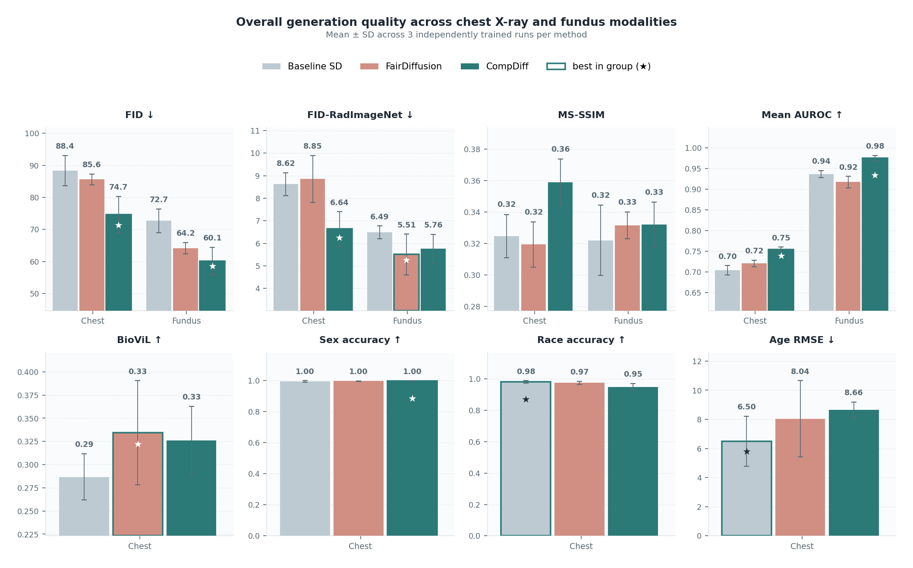

# CompDiff: Hierarchical Compositional Diffusion for Fair and Zero-Shot Intersectional Medical Image Generation

CompDiff conditions Stable Diffusion on demographic attributes (age, sex, race/ethnicity)
to generate fair, demographically-controllable synthetic medical images. Demographic
attributes are removed from the text prompt and routed through a dedicated
**Hierarchical Conditioner Network (HCN)**: a typed compositional conditioner that encodes
each attribute in its native type (sex and race as embeddings, age as a continuous value),
composes them hierarchically, and presents them to the diffusion UNet as separate,
separately supervised cross-attention tokens. The repository ships the CompDiff training
code alongside the baselines used in the paper (standard fine-tuning, FairDiffusion, and
an unstructured demographic encoder) for comparison.

**Project site:** [mahmoudibrahim98.github.io/compdiff-site](https://mahmoudibrahim98.github.io/compdiff-site/) ·
**Paper:** [arXiv:2603.16551](https://arxiv.org/abs/2603.16551) ·
**Pretrained models:** [compdiff-chest-xray](https://huggingface.co/mahmoudibra98/compdiff-chest-xray) ·
[compdiff-fundus](https://huggingface.co/mahmoudibra98/compdiff-fundus)


---

## Contents

- [Installation](#installation)
- [Quick start — generate images with our pretrained models](#quick-start--generate-images-with-our-pretrained-models)
- [Released models](#released-models)
- [How it works](#how-it-works)
- [Train your own models](#train-your-own-models)
  - [1. Prepare data](#1-prepare-data)
  - [2. Train](#2-train)
  - [3. Monitor validation](#3-monitor-validation)
  - [4. Generate a synthetic dataset](#4-generate-a-synthetic-dataset)
  - [5. Downstream evaluation](#5-downstream-evaluation)
  - [Configuration](#configuration)
- [Results](#results)
- [Citation](#citation)
- [Acknowledgments](#acknowledgments)

---

## Installation

```bash
git clone https://github.com/mahmoudibrahim98/CompDiff.git
cd CompDiff

conda create -n compdiff python=3.10
conda activate compdiff

pip install -r requirements.txt
```

Install PyTorch with CUDA from [pytorch.org](https://pytorch.org/) for GPU support, matching
your driver (a bare `pip install torch` may pull a CUDA build newer than your driver supports).
Image generation requires `diffusers>=0.35` (already in `requirements.txt`).

---

## Quick start — generate images with our pretrained models

The CompDiff checkpoints are released on the Hugging Face Hub. You do **not** need the
training code or any dataset to generate images — each model ships a turnkey
`CompDiffPipeline` that is downloaded automatically.

- **Chest X-ray:** [mahmoudibra98/compdiff-chest-xray](https://huggingface.co/mahmoudibra98/compdiff-chest-xray)
- **Fundus:** [mahmoudibra98/compdiff-fundus](https://huggingface.co/mahmoudibra98/compdiff-fundus)

### Command line

`generate.py` (repo root) downloads the chosen model and generates images:

```bash
# Chest X-ray
python generate.py --modality chest \
  --prompt "Cardiomegaly with small bilateral pleural effusions" \
  --sex female --race White --age 67 \
  --num_images 4 --output_dir generated

# Fundus
python generate.py --modality fundus \
  --prompt "glaucoma, severe vision loss, abnormal cup-disc ratio, myopia" \
  --sex male --race Asian --age 55 --seed 0
```

Run `python generate.py --help` for all options (`--num_inference_steps`,
`--guidance_scale`, `--negative_prompt`, `--dtype`, `--revision`, etc.).

### Python

```python
import torch
from huggingface_hub import snapshot_download

path = snapshot_download("mahmoudibra98/compdiff-chest-xray")
import sys; sys.path.insert(0, path)
from compdiff_pipeline import CompDiffPipeline

pipe = CompDiffPipeline.from_pretrained(path, device="cuda", dtype=torch.float16)
img = pipe.generate("Cardiomegaly with small bilateral pleural effusions",
                    sex="female", race="White", age=67)[0]
img.save("out.png")
```

### Conditioning conventions

- **Prompt:** clinical findings only — do **not** write age, sex or race into the text.
  All three are passed as arguments and conditioned by the model.
- **Sex:** `0=male`, `1=female` (strings like `male`/`female` also accepted).
- **Race:** chest — `0=White, 1=Black/African American, 2=Asian, 3=Hispanic/Latino`;
  fundus — `0=White, 1=Black/African American, 2=Asian` (no Hispanic/Latino).
- **Age:** a number of years. The chest model takes it as a continuous conditioner input
  (no binning); the current fundus release prepends it to the prompt (see
  [Released models](#released-models)).
- **Fundus findings vocabulary** (comma-joined, in order): glaucoma status
  (`glaucoma`/`non-glaucoma`), vision loss (`normal vision`/`mild`/`moderate`/`severe vision loss`),
  optional cup-to-disc ratio, optional refraction (`hyperopia`/`emmetropia`/`myopia`).
  Free-form prompts are out-of-distribution.

> **Research use only** — not a medical device. Do not use for diagnosis, screening,
> or clinical decision-making.

---

## Released models

| Model | Hub revision | Conditioner | Age |
|---|---|---|---|
| Chest X-ray (current) | `main` | typed 3-attribute HCN, 4 tokens (`configs/compdiff/train_compdiff_chest.yaml`) | continuous, through the conditioner |
| Chest X-ray (first release, July 2026) | `v1` | sex × race HCN, 1 token (`configs/hcn/train_hcn_age_from_promt.yaml`) | prepended to the prompt |
| Fundus (current) | `main` | sex × race HCN, 1 token | prepended to the prompt |

The chest model on `main` is the checkpoint behind the current version of the paper. The
fundus Hub model will be updated to the typed 3-attribute conditioner in the same way; until
then it is the first release. Every release keeps the same `generate(prompt, sex, race, age, ...)`
interface, and `generate.py --revision v1` selects the first chest release.

---

## How it works

CompDiff fine-tunes Stable Diffusion 2.1-base (UNet and CLIP text encoder) and injects
demographic attributes through a dedicated conditioner instead of the prompt. The methods
below are all trained with the same pipeline and selected via config.

| Method | Description | Config |
|--------|-------------|--------|
| **CompDiff** | Typed compositional HCN: sex/race embeddings + continuous age → pairwise composition → four supervised tokens | `configs/compdiff/train_compdiff_chest.yaml`, `configs/compdiff/train_compdiff_fundus.yaml` |
| HCN, sex × race (first release) | Same hierarchy over sex and race only; age stays in the prompt; one fused token | `configs/hcn/train_hcn_age_from_promt.yaml` |
| Demographic Encoder | Flat MLP over the attributes, no hierarchy (ablation) | `configs/FLAT/train_demographic_encoder.yaml` |
| Baseline | Standard SD fine-tuning, demographics in the text prompt only | `configs/baseline_SD/train_baseline.yaml` |
| FairDiffusion | Adaptive per-sample loss re-weighting (Fair Bayesian Perturbation) | `configs/fairdiffusion/train_baseline_fairdiffusion.yaml` |

**CompDiff conditioner (`gen_source/compdiff2.py`):**

- **Typed encoders.** Sex and race are nominal embeddings; age enters as a continuous value
  mapped through sinusoidal features and an MLP, so nearby ages get nearby representations.
- **Hierarchical composition.** Pairwise MLPs compose age×sex, age×race and sex×race, a
  further MLP fuses the three, and each attribute is re-contextualised against the composed
  state. Every pairwise component of a never-observed intersection is supported by training
  data from other cells, which is what makes zero-shot intersections reachable.
- **Per-attribute tokens.** Four tokens (`t_age`, `t_sex`, `t_race`, `t_cls`) are projected
  into the UNet cross-attention space and concatenated to the 77 CLIP text tokens
  (`[B, 81, 1024]`). Each token is supervised by its own auxiliary head during training
  (age regression, sex and race classification, joint-cell classification), so the tokens
  the UNet reads carry the attribute information.
- **Text pathway.** Demographics are stripped from every prompt; the text encoder only ever
  sees clinical findings.


---

## Train your own models

The steps below reproduce the paper from scratch on your own data. Skip this section if
you only want to generate images from the released checkpoints
([Quick start](#quick-start--generate-images-with-our-pretrained-models)).

### 1. Prepare data

Obtain the source datasets and build WebDataset tar files.

**Chest X-ray (MIMIC-CXR)**

- **Source:** [MIMIC-CXR Database v2.1.0](https://physionet.org/content/mimic-cxr/2.1.0/) (PhysioNet).
- **Access:** Credentialed — PhysioNet account, required training (e.g. CITI), and data use agreement.
- **Prepare** with a split CSV (columns: `split`, `image`, `final_sentence`, disease labels, demographics):

```bash
python prepare_datasets/prepare_chest_dataset.py \
  --source_dir /path/to/your/mimic-cxr \
  --output_dir /path/to/your/chest_webdataset \
  --split_csv /path/to/your/split_data.csv
```

**Fundus (FairGenMed)**

- **Source:** [FairGenMed dataset](https://drive.google.com/drive/folders/1kWgH6KGiIbtLMiXKUJpbcoXY8n28wSc2?usp=drive_link) (Google Drive), see [FairDiffusion](https://github.com/Harvard-Ophthalmology-AI-Lab/FairDiffusion).
- **Access:** Download from Drive; non-commercial research only (CC BY-NC-ND 4.0).
- **Prepare** (base dir has `Training/`, `Validation/`, `Test/` and `data_summary.csv`):

```bash
python prepare_datasets/prepare_fundus_dataset.py \
  --fundus_base_dir /path/to/your/fairgenmed \
  --output_dir /path/to/your/fundus_webdataset
```

Use `--help` on each script for options (`--max_samples_per_tar`, `--splits`, etc.).

Training prompts follow `"<AGE> year old <RACE> <SEX>. <IMPRESSION>"` for chest and
`"SLO fundus image of a <RACE>, <SEX>, <AGE> years old patient with the following conditions: <CONDITIONS>"`
for fundus; the data loader parses the demographics from the prompt and strips them from the
text when a conditioner is enabled.

**Demo data** — run the pipeline without the full datasets:

- Pre-built WebDatasets in `demo_chest/` and `demo_fundus/`.
- Chest demo CSV `real_chest/split_data_demo.csv` (10 rows) with placeholder images under
  `chest_images_skeleton/` (mirrors the MIMIC-CXR layout). Use
  `--split_csv real_chest/split_data_demo.csv --source_dir chest_images_skeleton` for a minimal run.

**Validation/metrics weights** — the `pretrained_models/` directory holds weights used
during training-time validation (not the released generators):

- **Sex classifier:** `pretrained_models/sex/resnet-all/epoch=13-step=7125.ckpt` — demographic
  (sex) prediction on generated images. Configs point here by default.
- **FID / RadImageNet:** `pretrained_models/fid_radnet/` — used when `compute_fid_radimagenet: true`
  (falls back to `torch.hub` if absent; `RADIMAGENET_LOCAL_DIR` overrides the location).
  See `pretrained_models/README.md`.

### 2. Train

```bash
cd gen_source

# CompDiff (chest)
python train.py --config_file ../configs/compdiff/train_compdiff_chest.yaml

# CompDiff (fundus)
python train.py --config_file ../configs/compdiff/train_compdiff_fundus.yaml

# Baseline
python train.py --config_file ../configs/baseline_SD/train_baseline.yaml

# FairDiffusion
python train.py --config_file ../configs/fairdiffusion/train_baseline_fairdiffusion.yaml
```

Multi-GPU with [Accelerate](https://github.com/huggingface/accelerate) (the chest model was
trained on 6 GPUs at per-device batch 8, the fundus runs on 4 GPUs at per-device batch 24):

```bash
accelerate launch --num_processes=6 --multi_gpu --mixed_precision bf16 \
  gen_source/train.py --config_file configs/compdiff/train_compdiff_chest.yaml
```

Set `dataloader_num_workers` to the number of training shards to keep the GPUs fed; the
default of `0` decodes every sample on rank 0. Note that the WebDataset shuffle is not seeded
by `seed`, so runs are independent replicates rather than exact repeats.

### 3. Monitor validation

```bash
accelerate launch --num_processes=8 --multi_gpu --mixed_precision bf16 \
  gen_source/run_validation_monitor_debug.py \
  --config_file configs/compdiff/train_compdiff_chest.yaml \
  --check_interval 300
```

Checkpoint selection in the paper is validation-based (chest: step 10,000; fundus: step 17,500).

### 4. Generate a synthetic dataset

```bash
accelerate launch --num_processes=6 --multi_gpu --mixed_precision bf16 \
  gen_source/generate_synthetic_dataset.py \
  --config_file configs/compdiff/train_compdiff_chest.yaml \
  --checkpoint_path outputs/compdiff/chest/checkpoint-10000 \
  --output_dir synthetic_datasets/output \
  --merge_csv
```

### 5. Downstream evaluation

Train and evaluate downstream classifiers (e.g. pathology) on real vs. synthetic chest
data. Run from the repo root:

```bash
python downstream_eval_chest/train_downstream_classifier.py \
  --strategy 1a \
  --real_train_path demo_chest/training_data \
  --real_val_path demo_chest/val_data \
  --real_test_path demo_chest/test_data \
  --output_dir outputs/downstream_eval
```

See [downstream_eval_chest/README.md](downstream_eval_chest/README.md) for strategies
(1a/1b), CheXpert evaluation, and analysis scripts.

### Configuration

Main YAML options (see `configs/` for full examples):

- **CompDiff:** `use_hcn: true`, `use_compdiff2: true`, `cd2_composer: hierarchical`,
  `cd2_multi_token: true`, `max_age: 100`, `hcn_num_sex: 2`, `hcn_num_race: 4` (chest) or `3` (fundus),
  `hcn_aux_weight: 1`, `strip_demographics_in_validation: true`
- **HCN, sex × race (first release):** `use_hcn: true`, `hcn_encode_age: false`, `keep_age_in_prompt: true`
- **Demographic Encoder:** `use_demographic_encoder: true`, `demo_mode: 'single'`, `demo_aux_weight: 1.0`
- **FairDiffusion:** `use_fairdiffusion: true`, `fairdiffusion_time_window: 30`, `fairdiffusion_exploitation_rate: 0.95`

---

## Results

Mean ± SD across three independently trained runs per method (validation split), from the
paper. Sampling: DDPM, 75 steps, classifier-free guidance 7.5, 512×512.

| | Chest FID ↓ | Chest FID-RadImageNet ↓ | Fundus FID ↓ | Fundus glaucoma AUROC ↑ | Fundus cup-disc AUROC ↑ |
|---|---|---|---|---|---|
| Baseline (SD fine-tune) | 88.4 ± 4.7 | 8.62 ± 0.51 | 72.7 ± 3.7 | 0.916 | 0.957 |
| FairDiffusion | 85.6 ± 1.7 | 8.85 ± 1.05 | 64.2 ± 1.8 | 0.930 | 0.904 |
| **CompDiff** | **74.7 ± 5.7** | **6.64 ± 0.77** | **60.1 ± 4.3** | **0.957** | **0.994** |

On two disjoint held-out splits of MIMIC-CXR, CompDiff synthesises demographic intersections
absent from training and attains the lowest per-cell RadImageNet FID on 15 of 16 held-out
cells against both baselines.



---

## Citation

```bibtex
@article{ibrahim2026compdiff,
  title   = {CompDiff: Hierarchical Compositional Diffusion for Fair and Zero-Shot Intersectional Medical Image Generation},
  author  = {Ibrahim, Mahmoud and Elen, Bart and Sun, Chang and Ertaylan, Gokhan and Dumontier, Michel},
  journal = {arXiv preprint arXiv:2603.16551},
  year    = {2026},
  url     = {https://arxiv.org/abs/2603.16551}
}
```

---

## Acknowledgments

This codebase builds on the [Hugging Face Diffusers](https://github.com/huggingface/diffusers) library.

- **[RoentGen-v2](https://github.com/StanfordMIMI/RoentGen-v2)** (Stanford MIMI): *Improving Performance, Robustness, and Fairness of Radiographic AI Models with Finely-Controllable Synthetic Data* — chest X-ray generation and baseline.
- **[FairDiffusion](https://github.com/Harvard-Ophthalmology-AI-Lab/FairDiffusion)** (Harvard Ophthalmology AI Lab): *FairDiffusion: Enhancing Equity in Latent Diffusion Models via Fair Bayesian Perturbation* ([Science Advances](https://www.science.org/doi/full/10.1126/sciadv.ads4593)) — fairness-aware training and FairGenMed dataset.
