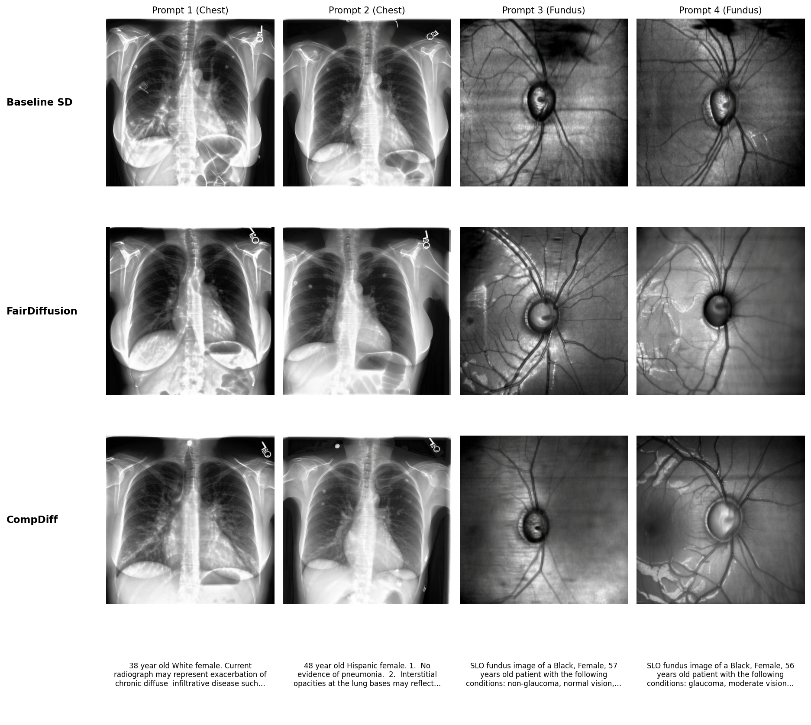
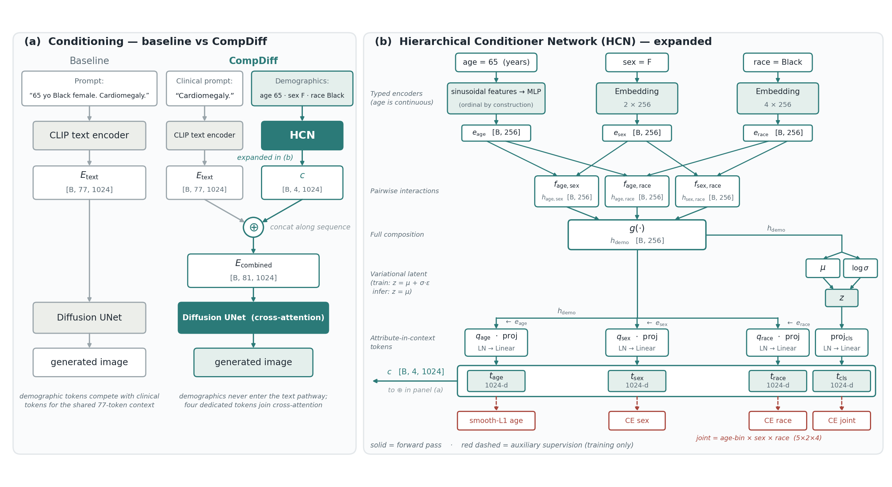
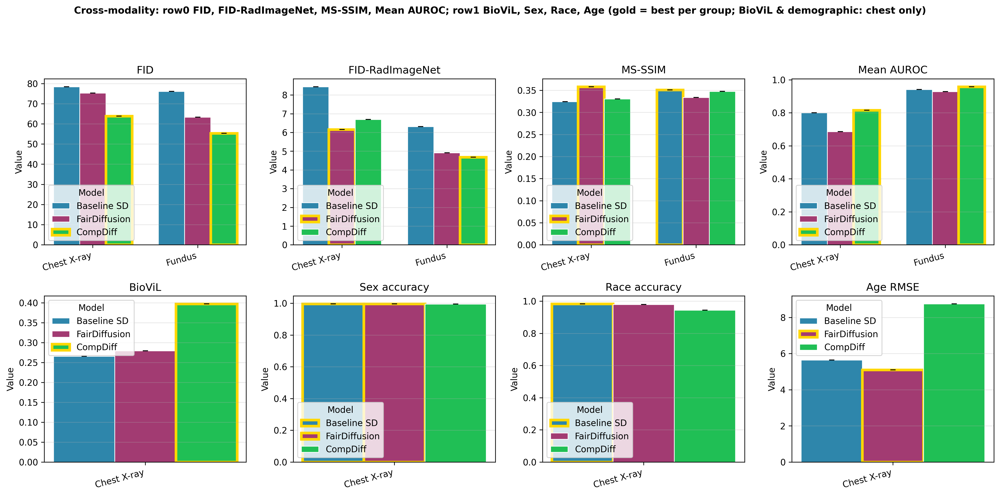

# CompDiff: Hierarchical Compositional Diffusion for Fair and Zero-Shot Intersectional Medical Image Generation

CompDiff conditions Stable Diffusion on demographic attributes (age, sex, race/ethnicity)
to generate fair, demographically-controllable synthetic medical images. It introduces a
**Hierarchical Conditioner Network (HCN)** and ships alongside several baselines
(Demographic Encoder, standard fine-tuning, FairDiffusion) for comparison.

**Project site:** [mahmoudibrahim98.github.io/compdiff-site](https://mahmoudibrahim98.github.io/compdiff-site/) ·
**Paper:** [arXiv:2603.16551](https://arxiv.org/abs/2603.16551) ·
**Pretrained models:** [compdiff-chest-xray](https://huggingface.co/mahmoudibra98/compdiff-chest-xray) ·
[compdiff-fundus](https://huggingface.co/mahmoudibra98/compdiff-fundus)



---

## Contents

- [Installation](#installation)
- [Quick start — generate images with our pretrained models](#quick-start--generate-images-with-our-pretrained-models)
- [How it works](#how-it-works)
- [Train your own models](#train-your-own-models)
  - [1. Prepare data](#1-prepare-data)
  - [2. Train](#2-train)
  - [3. Monitor validation](#3-monitor-validation)
  - [4. Generate a synthetic dataset](#4-generate-a-synthetic-dataset)
  - [5. Downstream evaluation](#5-downstream-evaluation)
  - [Configuration](#configuration)
- [Results](#results)
- [Citation](#citation)
- [Acknowledgments](#acknowledgments)

---

## Installation

```bash
git clone https://github.com/mahmoudibrahim98/CompDiff.git
cd CompDiff

conda create -n compdiff python=3.10
conda activate compdiff

pip install -r requirements.txt
```

Install PyTorch with CUDA from [pytorch.org](https://pytorch.org/) for GPU support.
Image generation additionally requires `diffusers>=0.35` (see
[Quick start](#quick-start--generate-images-with-our-pretrained-models)).

---

## Quick start — generate images with our pretrained models

Our best HCN checkpoints are released on the Hugging Face Hub. You do **not** need the
training code or any dataset to generate images — each model ships a turnkey
`CompDiffPipeline` that is downloaded automatically.

- **Chest X-ray:** [mahmoudibra98/compdiff-chest-xray](https://huggingface.co/mahmoudibra98/compdiff-chest-xray)
- **Fundus:** [mahmoudibra98/compdiff-fundus](https://huggingface.co/mahmoudibra98/compdiff-fundus)

Generation requires `diffusers>=0.35` (all other dependencies are in `requirements.txt`):

```bash
pip install -r requirements.txt
pip install "diffusers>=0.35"
```

### Command line

`generate.py` (repo root) downloads the chosen model and generates images:

```bash
# Chest X-ray
python generate.py --modality chest \
  --prompt "Cardiomegaly with small bilateral pleural effusions" \
  --sex female --race White --age 67 \
  --num_images 4 --output_dir generated

# Fundus
python generate.py --modality fundus \
  --prompt "glaucoma, severe vision loss, abnormal cup-disc ratio, myopia" \
  --sex male --race Asian --age 55 --seed 0
```

Run `python generate.py --help` for all options (`--num_inference_steps`,
`--guidance_scale`, `--negative_prompt`, `--dtype`, etc.).

### Python

```python
import torch
from huggingface_hub import snapshot_download

path = snapshot_download("mahmoudibra98/compdiff-chest-xray")
import sys; sys.path.insert(0, path)
from compdiff_pipeline import CompDiffPipeline

pipe = CompDiffPipeline.from_pretrained(path, device="cuda", dtype=torch.float16)
img = pipe.generate("Cardiomegaly with small bilateral pleural effusions",
                    sex="female", race="White", age=67)[0]
img.save("out.png")
```

### Conditioning conventions

- **Prompt:** clinical findings only — do **not** include sex/race. They are injected
  through the HCN. Age is prepended to the prompt automatically via `--age` / `age=`.
- **Sex:** `0=male`, `1=female` (strings like `male`/`female` also accepted).
- **Race:** chest — `0=White, 1=Black/African American, 2=Asian, 3=Hispanic/Latino`;
  fundus — `0=White, 1=Black/African American, 2=Asian` (no Hispanic/Latino).
- **Fundus findings vocabulary** (comma-joined, in order): glaucoma status
  (`glaucoma`/`non-glaucoma`), vision loss (`normal vision`/`mild`/`moderate`/`severe vision loss`),
  optional cup-to-disc ratio, optional refraction (`hyperopia`/`emmetropia`/`myopia`).
  Free-form prompts are out-of-distribution.

> **Research use only** — not a medical device. Do not use for diagnosis, screening,
> or clinical decision-making.

---

## How it works

CompDiff fine-tunes Stable Diffusion 2.1-base and injects demographic attributes through
different conditioning modules. The methods below are all trained with the same pipeline
and selected via config.

| Method | Description | Config | Use case |
|--------|-------------|--------|----------|
| **HCN** | Hierarchical composition (age×sex×race) + auxiliary loss | `configs/hcn/train_hcn_age_from_promt.yaml` | Best performance, structured encoding |
| **Demographic Encoder (V4)** | Flat MLP, no hierarchy | `configs/v4/train_demographic_encoder.yaml` | Ablate the hierarchical architecture |
| **v0 Baseline** | Standard SD fine-tuning (demographics in text only) | `configs/v0/train_baseline.yaml` | Baseline |
| **FairDiffusion** | Adaptive per-sample re-weighting (Bayesian) | `configs/fairdiffusion/train_baseline_fairdiffusion.yaml` | Fairness-aware |
| **HCN + FairDiffusion** | Both enabled | Set both flags in config | Ablation |

**Architecture:**

- **HCN:** Grandparents (age, sex, race) → Parents (pairwise) → Child (full composition);
  produces a conditioning token plus auxiliary classifiers that preserve demographic information.
- **Demographic Encoder:** Embeddings + MLP; single token or separate tokens for age, sex, race.
- **Baselines:** v0 = demographics in text only; FairDiffusion = per-sample re-weighting.



---

## Train your own models

The steps below reproduce the paper from scratch on your own data. Skip this section if
you only want to generate images from the released checkpoints
([Quick start](#quick-start--generate-images-with-our-pretrained-models)).

### 1. Prepare data

Obtain the source datasets and build WebDataset tar files.

**Chest X-ray (MIMIC-CXR)**

- **Source:** [MIMIC-CXR Database v2.1.0](https://physionet.org/content/mimic-cxr/2.1.0/) (PhysioNet).
- **Access:** Credentialed — PhysioNet account, required training (e.g. CITI), and data use agreement.
- **Prepare** with a split CSV (columns: `split`, `image`, `final_sentence`, disease labels, demographics):

```bash
python prepare_datasets/prepare_chest_dataset.py \
  --source_dir /path/to/your/mimic-cxr \
  --output_dir /path/to/your/chest_webdataset \
  --split_csv /path/to/your/split_data.csv
```

**Fundus (FairGenMed)**

- **Source:** [FairGenMed dataset](https://drive.google.com/drive/folders/1kWgH6KGiIbtLMiXKUJpbcoXY8n28wSc2?usp=drive_link) (Google Drive), see [FairDiffusion](https://github.com/Harvard-Ophthalmology-AI-Lab/FairDiffusion).
- **Access:** Download from Drive; non-commercial research only (CC BY-NC-ND 4.0).
- **Prepare** (base dir has `Training/`, `Validation/`, `Test/` and `data_summary.csv`):

```bash
python prepare_datasets/prepare_fundus_dataset.py \
  --fundus_base_dir /path/to/your/fairgenmed \
  --output_dir /path/to/your/fundus_webdataset
```

Use `--help` on each script for options (`--max_samples_per_tar`, `--splits`, etc.).

**Demo data** — run the pipeline without the full datasets:

- Pre-built WebDatasets in `demo_chest/` and `demo_fundus/`.
- Chest demo CSV `real_chest/split_data_demo.csv` (10 rows) with placeholder images under
  `chest_images_skeleton/` (mirrors the MIMIC-CXR layout). Use
  `--split_csv real_chest/split_data_demo.csv --source_dir chest_images_skeleton` for a minimal run.

**Validation/metrics weights** — the `pretrained_models/` directory holds weights used
during training-time validation (not the released generators):

- **Sex classifier:** `pretrained_models/sex/resnet-all/epoch=13-step=7125.ckpt` — demographic
  (sex) prediction on generated images. Configs point here by default.
- **FID / RadImageNet:** `pretrained_models/fid_radnet/` — used when `compute_fid_radimagenet: true`
  (falls back to `torch.hub` if absent). See `pretrained_models/README.md`.

### 2. Train

```bash
cd gen_source

# HCN
python train.py --config_file ../configs/hcn/train_hcn_age_from_promt.yaml

# Demographic Encoder (V4)
python train.py --config_file ../configs/v4/train_demographic_encoder.yaml

# Baseline
python train.py --config_file ../configs/v0/train_baseline.yaml

# FairDiffusion
python train.py --config_file ../configs/fairdiffusion/train_baseline_fairdiffusion.yaml
```

Multi-GPU with [Accelerate](https://github.com/huggingface/accelerate):

```bash
accelerate launch --num_processes=6 --multi_gpu --mixed_precision bf16 \
  gen_source/train.py --config_file configs/baseline_SD/train_baseline.yaml
```

### 3. Monitor validation

```bash
accelerate launch --num_processes=8 --multi_gpu --mixed_precision bf16 \
  gen_source/run_validation_monitor_debug.py \
  --config_file configs/hcn/train_hcn_age_from_promt.yaml \
  --check_interval 300
```

### 4. Generate a synthetic dataset

```bash
accelerate launch --num_processes=6 --multi_gpu --mixed_precision bf16 \
  gen_source/generate_synthetic_dataset.py \
  --config_file configs/hcn/train_hcn_age_from_promt.yaml \
  --checkpoint_path outputs/checkpoint-20000 \
  --output_dir synthetic_datasets/output \
  --merge_csv
```

### 5. Downstream evaluation

Train and evaluate downstream classifiers (e.g. pathology) on real vs. synthetic chest
data. Run from the repo root:

```bash
python downstream_eval_chest/train_downstream_classifier.py \
  --strategy 1a \
  --real_train_path demo_chest/training_data \
  --real_val_path demo_chest/val_data \
  --real_test_path demo_chest/test_data \
  --output_dir outputs/downstream_eval
```

See [downstream_eval_chest/README.md](downstream_eval_chest/README.md) for strategies
(1a/1b), CheXpert evaluation, and analysis scripts.

### Configuration

Main YAML options (see `configs/` for full examples):

- **HCN:** `use_hcn: true`, `hcn_num_age_bins: 5`, `hcn_num_sex: 2`, `hcn_num_race: 4`, `hcn_aux_weight: 1.0`, `hcn_encode_age: false`
- **Demographic Encoder:** `use_demographic_encoder: true`, `demo_mode: 'single'`, `demo_aux_weight: 1.0`
- **FairDiffusion:** `use_fairdiffusion: true`, `fairdiffusion_time_window: 30`, `fairdiffusion_exploitation_rate: 0.95`

---

## Results



*Cross-modality metrics (FID, MS-SSIM, BioViL, etc.) for HCN, Demographic Encoder,
v0 baseline, and FairDiffusion.*

---

## Citation

```bibtex
@article{ibrahim2026compdiff,
  title   = {CompDiff: Hierarchical Compositional Diffusion for Fair and Zero-Shot Intersectional Medical Image Generation},
  author  = {Ibrahim, Mahmoud and Elen, Bart and Sun, Chang and Ertaylan, Gokhan and Dumontier, Michel},
  journal = {arXiv preprint arXiv:2603.16551},
  year    = {2026},
  url     = {https://arxiv.org/abs/2603.16551}
}
```

---

## Acknowledgments

This codebase builds on the [Hugging Face Diffusers](https://github.com/huggingface/diffusers) library.

- **[RoentGen-v2](https://github.com/StanfordMIMI/RoentGen-v2)** (Stanford MIMI): *Improving Performance, Robustness, and Fairness of Radiographic AI Models with Finely-Controllable Synthetic Data* — chest X-ray generation and baseline.
- **[FairDiffusion](https://github.com/Harvard-Ophthalmology-AI-Lab/FairDiffusion)** (Harvard Ophthalmology AI Lab): *FairDiffusion: Enhancing Equity in Latent Diffusion Models via Fair Bayesian Perturbation* ([Science Advances](https://www.science.org/doi/full/10.1126/sciadv.ads4593)) — fairness-aware training and FairGenMed dataset.
