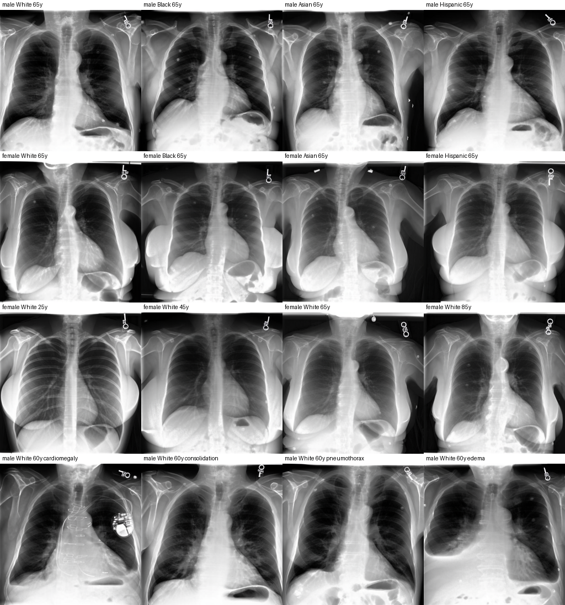
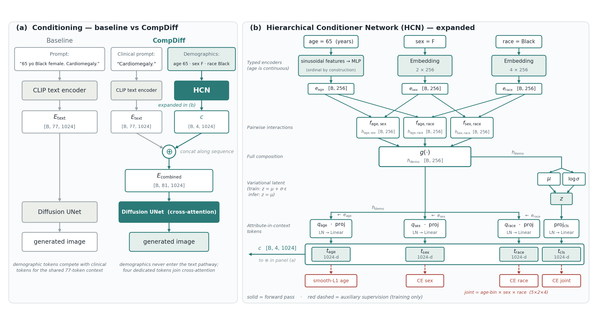
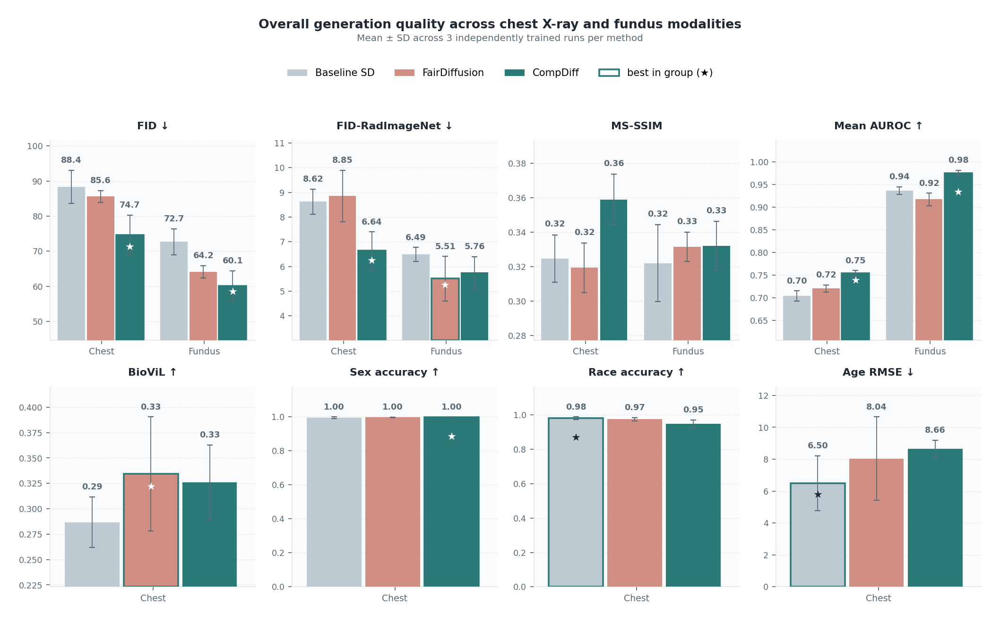

# CompDiff

**CompDiff enables fair and zero shot medical image generation across demographic intersections through compositional diffusion**

Mahmoud K. Ibrahim, Bart Elen, Chang Sun, Ahmad Jiblawi, Mohammed M. Saleh, Maryam K. Ibrahim, Gökhan Ertaylan, Michel Dumontier

[Project site](https://mahmoudibrahim98.github.io/compdiff-site/) ·
 [Models on Hugging Face](https://huggingface.co/collections/mahmoudibra98/compdiff-fair-intersectional-medical-image-generation-6a54b3ce9a66aa70a8ad534d) ·
[arXiv](https://arxiv.org/abs/2603.16551)

Medical image generators trained on imbalanced data can fail at demographic intersections that are absent from training. CompDiff removes age, sex and race from the text prompt and passes them through a **Hierarchical Conditioner Network (HCN)**, which encodes each attribute separately and composes supervised demographic tokens that the diffusion UNet reads alongside the clinical text. On chest X-rays (MIMIC-CXR) and fundus images (FairGenMed), CompDiff improves overall and subgroup fidelity relative to prompt conditioning (RoentGen-v2) and loss reweighting (FairDiffusion), and it generates chest X-ray intersections that were removed from training.



*Samples from the released chest X-ray model (`mahmoudibra98/compdiff-chest-xray`, `main`). Rows 1 and 2 vary race and sex at age 65, row 3 varies age for a White female patient, and row 4 varies the clinical finding.*

> **Research use only.** Not a medical device. Do not use for diagnosis, screening or clinical decision-making.

---

## Contents

- [Installation](#installation)
- [Quick start: generate images with the released models](#quick-start-generate-images-with-the-released-models)
- [Released models](#released-models)
- [How it works](#how-it-works)
- [Repository layout](#repository-layout)
- [Train your own models](#train-your-own-models)
- [Results](#results)
- [Citation](#citation)
- [Acknowledgments](#acknowledgments)

---

## Installation

```bash
git clone https://github.com/mahmoudibrahim98/CompDiff.git
cd CompDiff

conda create -n compdiff python=3.10
conda activate compdiff

pip install -r requirements.txt
```

Install PyTorch with CUDA from [pytorch.org](https://pytorch.org/) to match your driver; a bare `pip install torch` may pull a CUDA build newer than your driver supports. Image generation requires `diffusers>=0.35` (already in `requirements.txt`).

---

## Quick start: generate images with the released models

You do **not** need the training code or any dataset to generate images. Each model on the Hugging Face Hub ships a `CompDiffPipeline` that is downloaded automatically.

### Command line

```bash
# Chest X-ray
python generate.py --modality chest \
  --prompt "Cardiomegaly with small bilateral pleural effusions" \
  --sex female --race White --age 67 \
  --num_images 4 --output_dir generated

# Fundus
python generate.py --modality fundus \
  --prompt "glaucoma, severe vision loss, abnormal cup-disc ratio, myopia" \
  --sex male --race Asian --age 55 --seed 0
```

`python generate.py --help` lists all options (`--num_inference_steps`, `--guidance_scale`, `--negative_prompt`, `--dtype`, `--revision`, ...).

### Python

```python
import sys
import torch
from huggingface_hub import snapshot_download

path = snapshot_download("mahmoudibra98/compdiff-chest-xray")
sys.path.insert(0, path)
from compdiff_pipeline import CompDiffPipeline

pipe = CompDiffPipeline.from_pretrained(path, device="cuda", dtype=torch.float16)
img = pipe.generate("Cardiomegaly with small bilateral pleural effusions",
                    sex="female", race="White", age=67)[0]
img.save("out.png")
```

### Conditioning conventions

- **Prompt:** clinical findings only. Do not write age, sex or race into the text; they are passed as arguments.
- **Sex:** `0 = male`, `1 = female` (`male` / `female` also accepted).
- **Race:** chest `0 = White, 1 = Black/African American, 2 = Asian, 3 = Hispanic/Latino`; fundus `0 = White, 1 = Black/African American, 2 = Asian` (FairGenMed has no Hispanic/Latino patients).
- **Age:** years. The chest model takes it as a continuous conditioner input; the current fundus release prepends it to the prompt (see [Released models](#released-models)).
- **Fundus findings vocabulary** (comma-joined, in order): glaucoma status (`glaucoma` / `non-glaucoma`), vision (`normal vision` / `mild` / `moderate` / `severe vision loss`), optional cup-to-disc ratio, optional refraction (`hyperopia` / `emmetropia` / `myopia`). Free-form prompts are out of distribution.

---

## Released models

| Model | Hub revision | Conditioner | Age |
|---|---|---|---|
| Chest X-ray (current) | `main` | CompDiff HCN, 4 tokens (`configs/compdiff/train_compdiff_chest.yaml`) | continuous, through the conditioner |
| Chest X-ray (first release, July 2026) | `v1` | sex × race HCN, 1 token (`configs/hcn/train_hcn_age_from_promt.yaml`) | prepended to the prompt |
| Fundus (current) | `main` | sex × race HCN, 1 token | prepended to the prompt |

The chest model on `main` is checkpoint 10,000 of the seed-42 CompDiff run used in the current manuscript. The fundus model on the Hub is still the first release; it will be updated to the 4-token conditioner. Every release keeps the same `generate(prompt, sex, race, age, ...)` interface, and `generate.py --revision v1` selects the first chest release.

---

## How it works



CompDiff fine-tunes Stable Diffusion 2.1-base (UNet and CLIP text encoder, both unfrozen) and injects demographics through a dedicated conditioner instead of the prompt (`gen_source/compdiff2.py`):

- **Separate encoders.** Sex and race are learned categorical embeddings; age is a continuous value mapped through sinusoidal features and an MLP.
- **Composition.** Pairwise MLPs combine age + sex, age + race and sex + race; a composition MLP fuses them into a shared demographic context.
- **Four tokens.** Each attribute is projected with that context to its own token (`t_age`, `t_sex`, `t_race`), and a Gaussian latent (sampled during training, set to its mean at inference) supplies a composed token (`t_cls`). The 4 tokens of 1,024 dimensions are concatenated to CLIP's 77 text tokens (`[B, 81, 1024]`) as cross-attention context.
- **Supervision.** Auxiliary heads predict age (smooth L1), sex and race (cross-entropy) from their tokens and the joint demographic cell from the composed token, so each attribute survives to the UNet. These heads are used only during training.
- **Text pathway.** Demographics are stripped from every prompt, so the text encoder sees only the clinical impression.

The same training pipeline trains the comparison methods, selected by config:

| Method | Description | Config |
|---|---|---|
| **CompDiff** | HCN with separate encoders, composition and 4 supervised tokens | `configs/compdiff/train_compdiff_chest.yaml`, `configs/compdiff/train_compdiff_fundus.yaml` |
| RoentGen-v2 (prompt conditioning) | Standard SD fine-tuning with demographics in the prompt; "Baseline SD" in the paper's figures | `configs/baseline_SD/train_baseline.yaml` |
| FairDiffusion | Adaptive loss reweighting across demographic groups (Fair Bayesian Perturbation) | `configs/fairdiffusion/train_baseline_fairdiffusion.yaml` |
| Fused demographic embedding (ablation) | Demographic embeddings fused into one token with auxiliary supervision | `configs/FLAT/train_demographic_encoder.yaml` |
| sex × race HCN (first release) | Hierarchy over sex and race only, age in the prompt, one token | `configs/hcn/train_hcn_age_from_promt.yaml` |

---

## Repository layout

```
generate.py                  Generate images from the released Hub models
gen_source/                  Training, validation and generation code (run scripts from here or via accelerate)
  compdiff2.py               CompDiff conditioner (HCN, 4 tokens)
  train.py, train_loop.py    Training entry point and loop
  run_validation_monitor_debug.py   Validation monitor (FID, FID-RadImageNet, alignment, subgroup metrics)
  generate_synthetic_dataset.py     Synthetic-corpus generation from a checkpoint
  fairdiffusion.py           FairDiffusion baseline
  demographic_encoder.py     Fused demographic embedding (ablation)
  hcn.py                     sex × race HCN behind the first chest release (configs/hcn/)
  hcn_v7.py, hcn_v8_ordinal.py, hcn_v9_continuous_age.py, film.py
                             Earlier conditioner experiments, loaded only when their config flags are set
configs/                     Training configs for CompDiff and the comparison methods
prepare_datasets/            Build WebDataset shards from MIMIC-CXR and FairGenMed
downstream_eval_chest/       Downstream classifier training and evaluation on real vs. synthetic chest data
pretrained_models/           Weights used by the validation metrics (RadImageNet); see its README
real_chest/, chest_images_skeleton/   Ten-row split CSV and placeholder images for testing the data preparation step
legacy/                      SLURM scripts and downstream configs from earlier runs, kept for provenance
```

---

## Train your own models

These steps retrain the generators from the source datasets. Skip this section if you only want to generate images from the released models.

### 1. Prepare data

**Chest X-ray (MIMIC-CXR).** [MIMIC-CXR v2.1.0](https://physionet.org/content/mimic-cxr/2.1.0/) is available to credentialed PhysioNet users after the required training and data use agreement. Build WebDataset shards from a split CSV (columns: `split`, `image`, `final_sentence`, disease labels, demographics):

```bash
python prepare_datasets/prepare_chest_dataset.py \
  --source_dir /path/to/mimic-cxr \
  --output_dir data/chest_webdataset \
  --split_csv /path/to/split_data.csv
```

**Fundus (FairGenMed).** Download [FairGenMed](https://drive.google.com/drive/folders/1kWgH6KGiIbtLMiXKUJpbcoXY8n28wSc2?usp=drive_link) (see [FairDiffusion](https://github.com/Harvard-Ophthalmology-AI-Lab/FairDiffusion); non-commercial research use, CC BY-NC-ND 4.0). The base directory holds `Training/`, `Validation/`, `Test/` and `data_summary.csv`:

```bash
python prepare_datasets/prepare_fundus_dataset.py \
  --fundus_base_dir /path/to/fairgenmed \
  --output_dir data/fundus_webdataset
```

Each script writes `training_data/`, `val_data/` and `test_data/` under `--output_dir`; the configs in `configs/` expect `data/chest_webdataset/` and `data/fundus_webdataset/` (edit the paths if you put the data elsewhere). Use `--help` for options such as `--max_samples_per_tar` and `--splits`.

To check the chest preparation step without MIMIC-CXR access, run it on the bundled ten-row CSV and placeholder images:

```bash
python prepare_datasets/prepare_chest_dataset.py \
  --source_dir chest_images_skeleton \
  --output_dir data/chest_skeleton_test \
  --split_csv real_chest/split_data_demo.csv
```

Training prompts follow `"<AGE> year old <RACE> <SEX>. <IMPRESSION>"` (chest) and `"SLO fundus image of a <RACE>, <SEX>, <AGE> years old patient with the following conditions: <CONDITIONS>"` (fundus). The data loader parses the demographics and strips them from the text when a conditioner is enabled.

**Metric weights.** Validation uses RadImageNet weights from `pretrained_models/fid_radnet/` (falls back to `torch.hub`; `RADIMAGENET_LOCAL_DIR` overrides the location). Sex accuracy uses the torchxrayvision MIRA sex model, downloaded automatically. See [pretrained_models/README.md](pretrained_models/README.md).

### 2. Train

```bash
cd gen_source
python train.py --config_file ../configs/compdiff/train_compdiff_chest.yaml     # CompDiff, chest
python train.py --config_file ../configs/compdiff/train_compdiff_fundus.yaml    # CompDiff, fundus
python train.py --config_file ../configs/baseline_SD/train_baseline.yaml        # RoentGen-v2
python train.py --config_file ../configs/fairdiffusion/train_baseline_fairdiffusion.yaml
```

Multi-GPU with [Accelerate](https://github.com/huggingface/accelerate). The chest model was trained on 6 GPUs at per-device batch 8 (effective batch 48), the fundus runs on 4 GPUs at per-device batch 24:

```bash
accelerate launch --num_processes=6 --multi_gpu --mixed_precision bf16 \
  gen_source/train.py --config_file configs/compdiff/train_compdiff_chest.yaml
```

Set `dataloader_num_workers` to the number of training shards to keep the GPUs fed; the default of `0` decodes every sample on rank 0. The WebDataset shuffle is not seeded by `seed`, so repeated runs are independent replicates rather than exact repeats.

### 3. Monitor validation

```bash
accelerate launch --num_processes=8 --multi_gpu --mixed_precision bf16 \
  gen_source/run_validation_monitor_debug.py \
  --config_file configs/compdiff/train_compdiff_chest.yaml \
  --check_interval 300
```

Checkpoints are selected on validation. The released chest model is checkpoint 10,000 and the paper's fundus runs use checkpoint 17,500.

### 4. Generate a synthetic dataset

```bash
accelerate launch --num_processes=6 --multi_gpu --mixed_precision bf16 \
  gen_source/generate_synthetic_dataset.py \
  --config_file configs/compdiff/train_compdiff_chest.yaml \
  --checkpoint_path outputs/compdiff/chest/checkpoint-10000 \
  --output_dir synthetic_datasets/output \
  --merge_csv
```

### 5. Downstream evaluation

Train and evaluate pathology classifiers on real and synthetic chest data (run from the repo root):

```bash
python downstream_eval_chest/train_downstream_classifier.py \
  --strategy 1a \
  --real_train_path data/chest_webdataset/training_data \
  --real_val_path data/chest_webdataset/val_data \
  --real_test_path data/chest_webdataset/test_data \
  --output_dir outputs/downstream_eval
```

See [downstream_eval_chest/README.md](downstream_eval_chest/README.md) for the training strategies, CheXpert evaluation and analysis scripts.

### Configuration

Main YAML options (see `configs/` for full examples):

- **CompDiff:** `use_hcn: true`, `use_compdiff2: true`, `cd2_composer: hierarchical`, `cd2_multi_token: true`, `max_age: 100`, `hcn_num_sex: 2`, `hcn_num_race: 4` (chest) or `3` (fundus), `hcn_aux_weight: 1`, `strip_demographics_in_validation: true`
- **sex × race HCN (first release):** `use_hcn: true`, `hcn_encode_age: false`, `keep_age_in_prompt: true`
- **Fused demographic embedding:** `use_demographic_encoder: true`, `demo_mode: 'single'`, `demo_aux_weight: 1.0`
- **FairDiffusion:** `use_fairdiffusion: true`, `fairdiffusion_time_window: 30`, `fairdiffusion_exploitation_rate: 0.95`

---

## Results

Results from the current manuscript. Generation metrics are means ± SD across three independently trained runs per method and modality; sampling uses DDPM, 75 steps, classifier-free guidance 7.5, 512 × 512.

**Overall fidelity and prompt alignment**

| | Chest FID ↓ | Chest FID-RadImageNet ↓ | Chest disease AUROC ↑ | Fundus FID ↓ | Fundus glaucoma AUROC ↑ | Fundus cup-disc AUROC ↑ |
|---|---|---|---|---|---|---|
| RoentGen-v2 | 88.4 ± 4.7 | 8.62 ± 0.51 | 0.704 ± 0.011 | 72.7 ± 3.7 | 0.916 | 0.957 |
| FairDiffusion | 85.6 ± 1.7 | 8.85 ± 1.05 | 0.720 ± 0.008 | 64.2 ± 1.8 | 0.930 | 0.904 |
| **CompDiff** | **74.7 ± 5.7** | **6.64 ± 0.77** | **0.754 ± 0.006** | **60.1 ± 4.3** | **0.957** | **0.994** |

Disease AUROC measures whether generated images express their prompted findings (five chest findings, pretrained classifier). On fundus, FairDiffusion had the lowest FID-RadImageNet (5.51 versus 5.76); Inception FID is the primary fundus measure because RadImageNet is out of domain there. CompDiff had lower race accuracy (0.949) and higher age error (8.66 years RMSE) than the prompt-conditioned baselines; neither difference was statistically distinguishable across the three runs.



**Subgroup fidelity.** CompDiff had the lowest distance in 28 of 29 overall, equity-scaled and subgroup comparisons across sex, race and age on both modalities (the exception: the Black fundus stratum, where FairDiffusion was lower by 1.1 FID). Among chest X-ray intersections with at least twenty images, CompDiff had the lowest FID-RadImageNet in all 16 cells.

**Intersections removed from training.** Two MIMIC-CXR training variants each withheld eight intersections (Holdout A: the eight rarest; Holdout B: the eight next rarest), and each method was trained three times per holdout. CompDiff had the lowest mean FID-RadImageNet in all 16 withheld intersections. Averaged across cells and holdouts, CompDiff minus RoentGen-v2 was −2.36 (95% CI −3.71 to −1.02) and CompDiff minus FairDiffusion was −1.25 (−2.57 to 0.08).

**Radiologist assessment.** Two board-certified radiologists, blinded to source, rated images from the 16 withheld intersections (96 rater–set assessments, 288 image ratings):

| Source | Realism (1–5) ↑ | Prompt correspondence (−2 to +2) ↑ | Chosen as most realistic ↑ |
|---|---|---|---|
| **CompDiff** | 4.17 ± 1.11 | +0.47 ± 1.72 | 48% |
| RoentGen-v2 | 2.36 ± 1.33 | −0.05 ± 1.69 | 7% |
| FairDiffusion | 4.13 ± 1.05 | +0.01 ± 1.74 | 37% |
| Real (hidden anchor) | 4.92 ± 0.29 | +0.75 ± 1.86 | 92% |

Prompt correspondence was higher for CompDiff than for RoentGen-v2 and FairDiffusion (Benjamini–Hochberg-adjusted p = 0.005 and 0.031). The direct preference comparison with FairDiffusion (44 to 35) was not statistically significant (p = 0.37).

**Downstream classification.** Classifiers trained only on synthetic chest images reached mean AUROC over eight labels of 0.7962 with CompDiff versus 0.7849 with RoentGen-v2 on MIMIC-CXR (+0.0113, 95% CI 0.0067 to 0.0158), and 0.7363 versus 0.7275 on external CheXpert (+0.0088, 0.0039 to 0.0137). With synthetic pretraining and real fine-tuning, CompDiff improved this AUROC in 40 of 48 matched configurations on each test set.

---

## Citation

The journal manuscript is under review. Until it is published, please cite:

```bibtex
@unpublished{ibrahim2026compdiff,
  title  = {CompDiff enables fair and zero shot medical image generation across demographic intersections through compositional diffusion},
  author = {Ibrahim, Mahmoud K. and Elen, Bart and Sun, Chang and Jiblawi, Ahmad and Saleh, Mohammed M. and Ibrahim, Maryam K. and Ertaylan, G{\"o}khan and Dumontier, Michel},
  note   = {Manuscript under review},
  year   = {2026}
}
```

Preprint: [arXiv:2603.16551](https://arxiv.org/abs/2603.16551).

---

## Acknowledgments

This work was funded by the European Union under the Horizon Europe grant 101095435. The codebase builds on [Hugging Face Diffusers](https://github.com/huggingface/diffusers).

- **[RoentGen-v2](https://github.com/StanfordMIMI/RoentGen-v2)** (Stanford MIMI): *Improving Performance, Robustness, and Fairness of Radiographic AI Models with Finely-Controllable Synthetic Data*; chest X-ray generation and the prompt-conditioned baseline.
- **[FairDiffusion](https://github.com/Harvard-Ophthalmology-AI-Lab/FairDiffusion)** (Harvard Ophthalmology AI Lab): *FairDiffusion: Enhancing Equity in Latent Diffusion Models via Fair Bayesian Perturbation* ([Science Advances](https://www.science.org/doi/full/10.1126/sciadv.ads4593)); loss-reweighting baseline and the FairGenMed dataset.

Questions and bug reports: please open a [GitHub issue](https://github.com/mahmoudibrahim98/CompDiff/issues).
